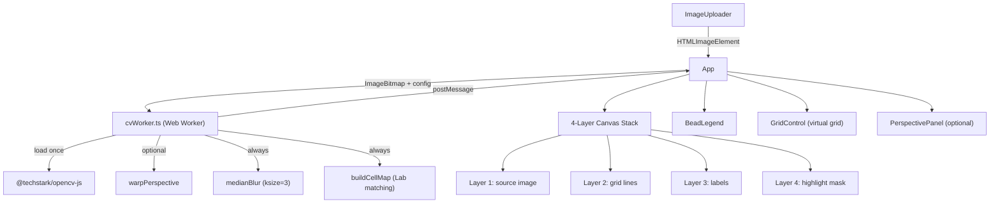

# OpenCV.js + Web Worker Architecture Upgrade

## Architecture Overview




## Layer System

Four absolutely-stacked canvases replace the current 2-layer approach. Each is sized at `naturalWidth * dpr` × `naturalHeight * dpr` with CSS size `naturalWidth × naturalHeight`:


| Layer        | Canvas ref | Redrawn when               | pointer-events |
| ------------ | ---------- | -------------------------- | -------------- |
| L1 source    | `srcRef`   | image changes              | none           |
| L2 grid      | `gridRef`  | grid settings change       | none           |
| L3 labels    | `labelRef` | cellMap or grid changes    | none           |
| L4 highlight | `hlRef`    | `highlightId` changes only | none           |


Highlight changes only touch L4 — no full re-render, enabling 60fps on mobile.

## File Changes

### New files

- `[src/workers/cvWorker.ts](src/workers/cvWorker.ts)` — Web Worker: loads OpenCV.js, handles `warpPerspective`, `medianBlur`, `buildCellMap`
- `[src/components/PerspectivePanel.tsx](src/components/PerspectivePanel.tsx)` — 4-corner picker UI (optional advanced mode)
- `[src/utils/hiDpi.ts](src/utils/hiDpi.ts)` — `setupHiDpiCanvas(canvas, w, h)` helper

### Modified files

- `[src/components/CanvasViewer.tsx](src/components/CanvasViewer.tsx)` — 4-layer stack, HiDPI setup, remove all heavy computation
- `[src/components/GridControl.tsx](src/components/GridControl.tsx)` — add 0.1px fine-offset inputs, remove auto-detect (moved to worker)
- `[src/App.tsx](src/App.tsx)` — wire worker, add perspective state, add `dpr` state
- `[src/utils/enhancedRenderer.ts](src/utils/enhancedRenderer.ts)` — split into 3 pure render functions (grid, labels, highlight), remove `buildCellMap` (now in worker)
- `[src/utils/gridDetect.ts](src/utils/gridDetect.ts)` — keep as fallback, but primary path is virtual grid from user input
- `[vite.config.ts](vite.config.ts)` — add `worker: { format: 'es' }` for Vite worker bundling
- `[package.json](package.json)` — add `@techstark/opencv-js`
- `[tsconfig.json](tsconfig.json)` — add `"esModuleInterop": true`
- `[index.html](index.html)` — no changes needed (worker loaded via `?worker` import)

## Implementation Details

### 1. Worker protocol (`src/workers/cvWorker.ts`)

```typescript
// Worker receives one of these message types:
type WorkerMsg =
  | { type: 'INIT' }
  | { type: 'PROCESS'; bitmap: ImageBitmap; cols: number; rows: number;
      offsetX: number; offsetY: number; corners?: [x:number,y:number][] }

// Worker sends back:
type WorkerResult =
  | { type: 'READY' }
  | { type: 'CELL_MAP'; cells: TransferableCellInfo[]; processedBitmap: ImageBitmap }
  | { type: 'ERROR'; message: string }
```

Worker lifecycle:

1. On `INIT`: `import cvReadyPromise from '@techstark/opencv-js'; cv = await cvReadyPromise; postMessage({type:'READY'})`
2. On `PROCESS`:
  - `cv.matFromImageData(...)` from the bitmap
  - If `corners` provided: `cv.warpPerspective(src, dst, M, dsize)`
  - Always: `cv.medianBlur(mat, blurred, 3)`
  - Sample each cell center (3×3 average), run CIEDE2000 match
  - `postMessage({type:'CELL_MAP', cells, processedBitmap}, [processedBitmap])`
  - `mat.delete(); blurred.delete()` — always clean up Mats

### 2. HiDPI canvas setup (`src/utils/hiDpi.ts`)

```typescript
export function setupHiDpiCanvas(
  canvas: HTMLCanvasElement,
  cssW: number,
  cssH: number,
): CanvasRenderingContext2D {
  const dpr = Math.min(window.devicePixelRatio ?? 1, 3) // cap at 3x
  canvas.width = Math.round(cssW * dpr)
  canvas.height = Math.round(cssH * dpr)
  canvas.style.width = cssW + 'px'
  canvas.style.height = cssH + 'px'
  const ctx = canvas.getContext('2d')!
  ctx.scale(dpr, dpr)
  ctx.imageSmoothingEnabled = false
  return ctx
}
```

All 4 layers use this. Labels drawn at `dpr`-scaled coordinates are crisp at 2x/3x.

### 3. Virtual grid (no auto-detection dependency)

`GridSettings` gains `offsetXFine: number` (0.1px steps, range ±cellW). The virtual grid formula:

```
cellW = imageWidth / cols
cellH = imageHeight / rows
gridStartX = offsetX + offsetXFine
gridStartY = offsetY + offsetYFine
cell(c, r).centerX = gridStartX + c * cellW + cellW/2
cell(c, r).centerY = gridStartY + r * cellH + cellH/2
```

Auto-detect still runs as a convenience to pre-fill `cols`/`rows`/`offsetX`/`offsetY`, but the user can override freely.

### 4. Perspective Panel (`src/components/PerspectivePanel.tsx`)

- Hidden by default; shown via "透视校正" toggle in the header
- Renders 4 draggable corner markers over the source canvas
- Corner state: `corners: [TL, TR, BR, BL]` as `[x,y]` pairs in image coordinates
- "应用变换" button sends corners to worker → worker runs `warpPerspective` → returns new `processedBitmap` → replaces source layer
- "重置" button clears corners and reverts to original image

### 5. Highlight layer (L4) — 60fps path

```typescript
// Only redraws L4 when highlightId changes
useEffect(() => {
  const ctx = setupHiDpiCanvas(hlRef.current!, cssW, cssH)
  renderHighlightLayer(ctx, cellMap, highlightId, grid)
}, [highlightId]) // NOT in cellMap dependency
```

`renderHighlightLayer` only draws a white mask + clear-holes. L1/L2/L3 are untouched.

### 6. Vite worker config

```typescript
// vite.config.ts
export default defineConfig({
  plugins: [react(), tailwindcss()],
  worker: { format: 'es' },
})
```

Worker import in App.tsx:

```typescript
import CvWorker from './workers/cvWorker?worker'
const worker = useMemo(() => new CvWorker(), [])
```

## Migration Notes

- `buildCellMap` and `detectExistingLabels` move entirely into the worker — remove from `enhancedRenderer.ts`
- `enhancedRenderer.ts` becomes 3 pure functions: `renderGridLayer`, `renderLabelLayer`, `renderHighlightLayer`
- `colorAnalysis.ts` (CIEDE2000 matching) is duplicated into the worker file since workers can't import from the main bundle directly in all Vite configs — or use `?worker&url` with shared modules
- The `SamplingControl` component is removed (sampling is now always 3×3 center after medianBlur)
- `gridDetect.ts` is kept but demoted to "optional hint" — the primary UX is user-specified cols/rows

